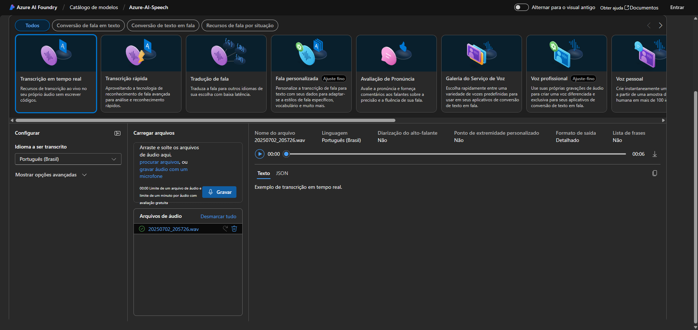
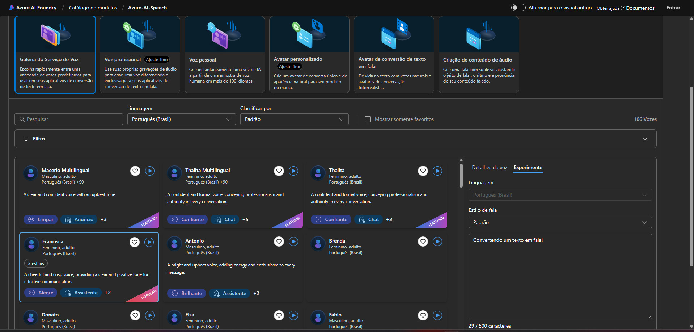

# 🚀 Desafio - Azure Speech Studio & Language Studio  

Este repositório foi criado como parte do desafio da [DIO](https://www.dio.me/), com o objetivo de praticar o uso das ferramentas **Azure Speech Studio** e **Language Studio**, explorando análise de fala e linguagem natural.  

O projeto documenta minha experiência, insights e aprendizados adquiridos durante a prática, servindo como material de apoio para estudos futuros e implementação de soluções baseadas em **IA generativa** aplicada à voz e linguagem.  

---

## 🎯 Objetivos de Aprendizagem  

Ao concluir este desafio, fui capaz de:  

- ✅ Aplicar os conceitos aprendidos em um ambiente prático;  
- ✅ Documentar processos técnicos de forma clara e organizada;  
- ✅ Utilizar o **GitHub** como ferramenta de versionamento e compartilhamento de documentação técnica.  

---

## 📂 Estrutura do Repositório  

```bash
.
├── README.md              # Documentação principal do projeto
├── /images                # Capturas de tela do laboratório
└── insights.md            # Anotações e reflexões sobre a prática
```

## 🧩 Etapas do Desafio

  1. Assistir a todas as vídeo-aulas disponíveis no laboratório.
  2. Seguir cada etapa de prática no Azure Speech Studio e Language Studio.
  3. Documentar a experiência com anotações, prints e observações.
  4. Organizar e publicar no GitHub.

## 💡 Insights Adquiridos  

Durante a prática, observei que:  
- O **Speech Studio** é altamente eficaz para transcrição de voz em tempo real e pode ser integrado a chatbots e assistentes virtuais.  
- O **Language Studio** fornece análises de sentimentos, tradução e entendimento de linguagem natural, possibilitando cenários avançados de **NLP** (Natural Language Processing).  
- A integração entre fala e linguagem abre espaço para soluções inteligentes de atendimento automatizado e análise de comunicação.  

📌 Detalhei essas observações e reflexões no arquivo [insights.md](./insights.md).

## 📸 Exemplos da Prática  

### Azure Speech Studio  
Transcrição de voz em tempo real:  
  

Conversão de texto em fala (TTS):  
  

## 🔗 Recursos Úteis

[🌐 Speech Studio - Microsoft Learning](https://learn.microsoft.com/azure/cognitive-services/speech-service/)

[🌐 Language Studio - Microsoft Learning](https://learn.microsoft.com/azure/cognitive-services/language-service/)

[📘 GitHub Docs](https://docs.github.com/)

[📘 Guia Markdown no GitHub](https://guides.github.com/features/mastering-markdown/)

## ✨ Autor

Desenvolvido por Guilherme Galarça Dutra 👨‍💻

[LinkedIn](https://www.linkedin.com/in/guilherme-g-dutra/) | [GitHub](https://github.com/udutra/)
